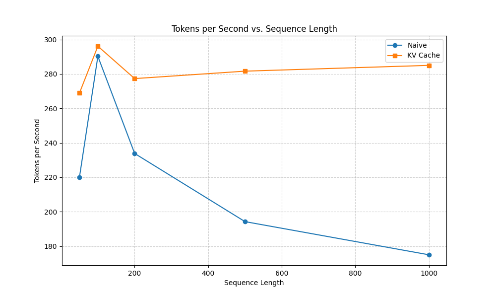
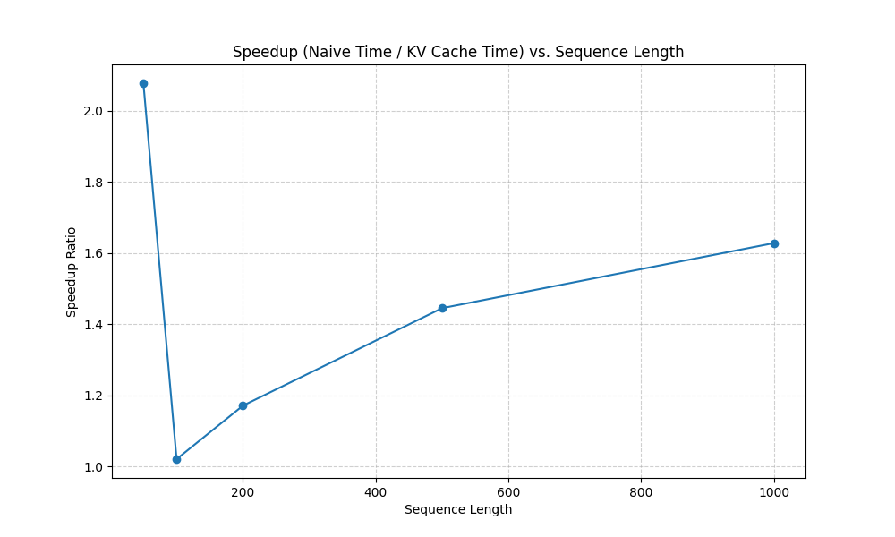
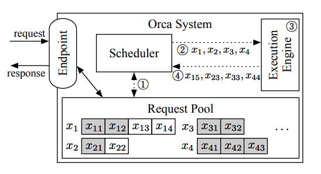
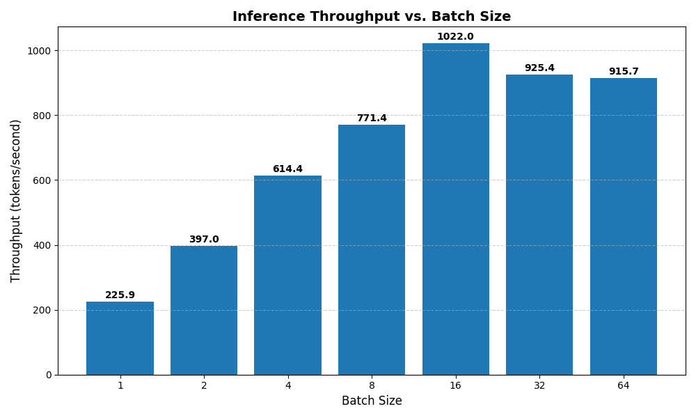

# Custom LLM Inference Engine

[](https://colab.research.google.com/github/LightY-01/llm-inference-engine/blob/main/llm_inference_engine.ipynb)

A PyTorch-based Transformer inference engine built entirely from scratch. The goal of this project is to optimize a custom GPT codebase by implementing the core serving mechanisms used by production engines like vLLM, TGI, and Ollama. 

Inference optimization is a critical engineering challenge where memory bandwidth, rather than pure compute, is the primary bottleneck. This project tackles that bottleneck through three major architectural upgrades.

---

## Project Roadmap

- **Phase 1: KV-Caching (Complete)**
  Pre-allocating key/value tensor buffers to avoid recomputing past states during autoregressive generation.
- **Phase 2: Continuous Batching (Complete)**
  Implementing an iteration-level scheduling system (based on the ORCA paper) to dynamically queue, batch, and execute concurrent requests at every single decode step.
- **Phase 3: Speculative Decoding (Planned)**
  Deploying a secondary, scaled-down "draft" model to auto-regressively propose K future tokens, which the primary model verifies in a single forward pass using rejection sampling.

---

## Phase 1 Optimization Benchmarks: KV-Caching

### Theoretical Context
In standard autoregressive generation, a naive forward pass recalculates the attention scores for every single token in the sequence just to generate the next word. This results in a time complexity of O(N^2) - as the context grows, compute time grows quadratically.

By implementing a Key-Value (KV) Cache, we store the previously computed Key and Value matrices in memory. For every new token, the model only computes attention for that single token and fetches the historical keys/values from the cache. This reduces the time complexity of the generation step to O(N), turning a compute-heavy loop into a memory-bandwidth-bound operation.

### CPU vs. GPU Benchmarking Note
* **CPU Behavior:** On CPU, naive generation is painfully slow due to the lack of massive parallelization for quadratic calculations, resulting in highly dramatic execution time gaps (e.g., naive taking 120s vs. KV-Cached taking 15s for 1000 tokens).
* **GPU Behavior:** When running on a GPU, the maximum absolute time gap is narrower (e.g., ~2 seconds difference). However, the throughput (tokens per second) plots shows that naive method collapses quadratically as the sequence length increases, whereas the KV cache throughput remains stable and high.

### Benchmark Visualizations

#### 1. CPU KV-Cache Performance


#### 2. GPU KV-Cache Performance



---

## Phase 2: Continuous Batching (ORCA Architecture)

### System Overview
Instead of grouping incoming requests into a static batch (which forces the system to wait for the slowest request to finish generating - a problem known as "generation stragglers"), I implement **Continuous Batching** (iteration-level scheduling), as pioneered by Yu et al. in the ORCA paper (OSDI 2022).

Reference Paper: [Orca: A Distributed Serving System for Transformer-Based Generative Models](https://www.usenix.org/conference/osdi22/presentation/yu)



My continuous batching engine is split into four decoupled components:

1. **Request Class:** Wraps the prompt, tracks generated tokens, manages execution state (`is_finished`), and stores the request's individual `KVCache` buffers.
2. **Scheduler:** Manages the request pool (a `waiting_queue` and an `active_requests` pool) and implements a First-Come, First-Served (FCFS) scheduling policy up to `max_batch_size`.
3. **ExecutionEngine:** A stateless runner that aggregates active requests, handles all tensor formatting (padding inputs, combining causal and padding attention masks, concatenating/splitting KV caches), runs the model forward pass, and extracts the next token.
4. **InferenceServer:** The public API endpoint that instantiates the scheduler and execution engine, initializes KV caches for new requests, and orchestrates the step-by-step loop.

### GPU Throughput Benchmarking & Saturation Analysis

Continuous batching throughput is benchmarked across different batch sizes (1, 2, 4, 8, 16, 32 and 64) under concurrent request stress tests:



#### Why Throughput Saturates/Flattens at Higher Batch Sizes:
1. **Padding Overhead:** Because vanilla PyTorch lacks ragged tensor operations, variable-length batch sequences must be padded to the longest sequence in the batch. As the batch size increases, the proportion of redundant computation spent on processing zero-padding tokens grows rapidly.
2. **Memory Bandwidth Bottleneck:** LLM generation is heavily memory-bandwidth bound. Fetching the model weights and cache tensors for multiple concurrent batches eventually saturates the GPU's memory bus. Once saturated, increasing batch size yields diminishing returns.
3. **Model Scale:** For a smaller model (such as this 4-block, 512-dim toy model), the GPU is under-utilized at small batch sizes. Increasing the batch size to 32 or 64 saturates the GPU execution pipelines, causing throughput to flatten.

---

## Challenges & Debugging

During the implementation of Phase 2, I solved several critical engineering challenges:

### 1. Lack of a 2D Positions Tensor
Initially, the model assumed position indices were a 1D range corresponding to the sequence step. In a continuous batching setup, requests in the same batch are at different execution steps (e.g., Request A is at prefill step 0, while Request B is at decode step 50). Using a 1D position ID failed. I resolved this by passing a 2D `positions` tensor of shape `(batch_size, max_input_len)` that maps each token to its exact absolute position in its individual sequence, right-padded with zeros.

### 2. Going Out of the Context Window (256-Token Limit)
With a 256-token context limit, sequence lengths exceeding 256 threw an `IndexError` in the model's position embedding layer. Furthermore, because vanilla PyTorch batching pads caches to `max_cached_len` and inputs to `max_input_len`, the combined sequence length `max_cached_len + max_input_len` exceeded 256 in mixed prefill/decode batches. This caused the model's attention block to truncate the batch cache to 256, causing index slicing crashes in the execution engine.  
To Fix this, I implemented pre-execution truncation. Before building the batch tensors, the engine crops the individual prompts/caches to fit within the `context_length - input_len` budget. This guarantees the batch sequence length never exceeds 256, making all position lookups and cache slicing operations safe and in-bounds.

### 3. Mixed Prefill and Decode Cache Initialization Bug
When a new prefill request (with no cache yet) was batched with an active decode request (with cache), the engine created zero-padding tensors for the prefill request but failed to assign them back to the key/value pointers (`req_k` and `req_v`). This led to appending `None` into the batch cache list, triggering a `TypeError` during `torch.cat`. I resolved this by assigning the zero-padding tensors directly to the request cache variables before batch concatenation.

---

## 📂 Repository Directory

- `inference_server.py`: Public API wrapper containing the `InferenceServer` orchestrator, the `Scheduler`, and the `ExecutionEngine`.
- `test_cb.py`: Correctness verification script for continuous batching.
- `benchmark_cb.py`: Stress-testing benchmark for continuous batching throughput across multiple batch sizes.
- `model.py`: Core Transformer model containing Grouped Query Attention (GQA) and KV Cache integration.
- `generate.py`: Text generation logic implementing `generate_naive()` and `generate_with_kvcache()`.
- `data.py`: Pre-tokenization utilities and `Tokenizer` wrapper for the GPT-2 vocabulary.
- `inference.py`: Verification runner that loads weights, generates text, and asserts token-by-token equality.
- `benchmark_kv.py`: Benchmark runner for naive vs. KV-cached generation times.
- `run.py`: Baseline training script for reference.
- `llm_inference_engine.ipynb`: Jupyter notebook to run training, evaluation, and all benchmarks directly in Google Colab.

---

## How to Run

### 1. Verify Correctness (Continuous Batching)
Confirm that the batched continuous generation matches solo request generation token-by-token:
```bash
python test_cb.py
```

### 2. Run Continuous Batching Benchmark
Run the stress test across multiple batch sizes and generate the throughput comparison bar chart:
```bash
python benchmark_cb.py
```

### 3. Run KV-Cache Benchmarks
Generate the raw benchmarking CSV and performance graphs for Phase 1:
```bash
python benchmark_kv.py
```
