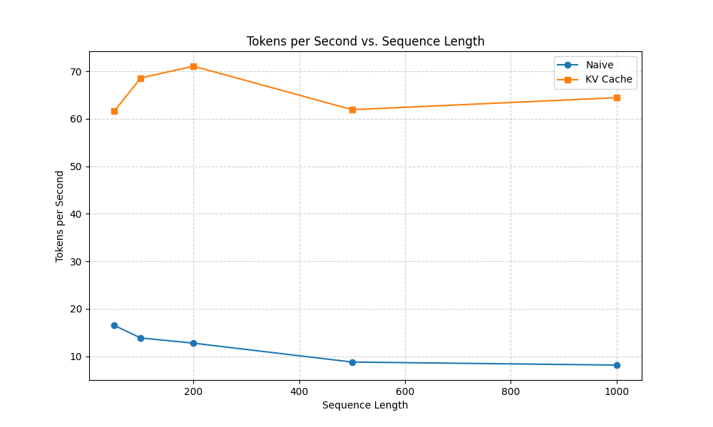
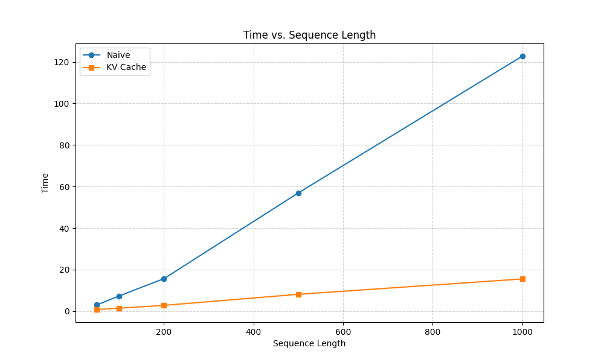
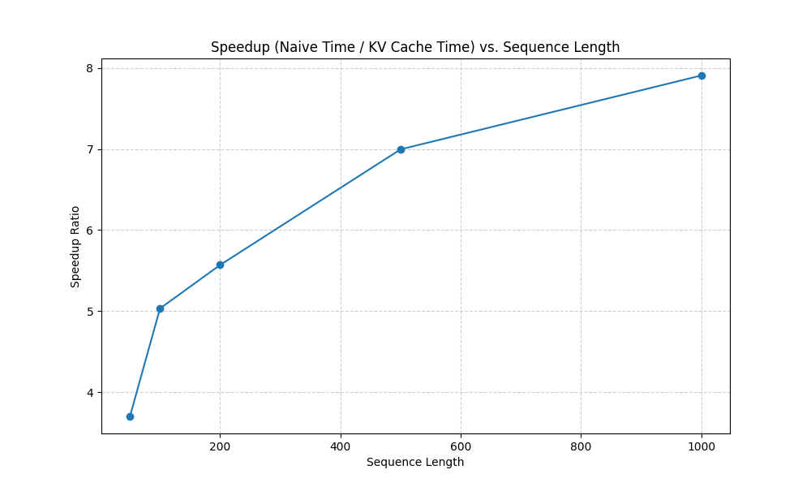

# Custom LLM Inference Engine

A PyTorch-based Transformer inference engine built entirely from scratch. The goal of this project is to optimize a custom GPT codebase by implementing the core serving mechanisms used by production engines like vLLM, TGI, and Ollama. 

Inference optimization is a critical engineering challenge where memory bandwidth, rather than pure compute, is the primary bottleneck. This project tackles that bottleneck through three major architectural upgrades.

---

## Project Roadmap

- [x] **Phase 1: KV-Caching (Complete)**
  Pre-allocating key/value tensor buffers to avoid recomputing past states during autoregressive generation. (See benchmarks below).
- [ ] **Phase 2: Continuous Batching (In Progress)**
  Replacing static batching with a dynamic request manager that queues and batches concurrent requests at every single decode step, utilizing padding masks to handle variable-length sequences.
- [ ] **Phase 3: Speculative Decoding (Planned)**
  Deploying a secondary, scaled-down "draft" model to auto-regressively propose $K$ future tokens, which the primary model verifies in a single forward pass using rejection sampling. 

---

## Phase 1 Optimization Benchmarks: KV-Caching

### Theoretical Context
In standard autoregressive generation, a naive forward pass recalculates the attention scores for every single token in the sequence just to generate the next word. This results in a time complexity of $O(N^2)$—as the context grows, compute time grows quadratically.

By implementing a **Key-Value (KV) Cache**, we store the previously computed Key and Value matrices in memory. For every new token, the model only computes attention for that single token and fetches the historical keys/values from the cache. This reduces the time complexity of the generation step to $O(N)$, turning a compute-heavy loop into a memory-bandwidth-bound operation.

### Performance Results
*Tested on custom GPT model (4 blocks, 12 attention heads, 6 KV heads, 512 embedding dimension). Results are averaged over 3 runs per sequence length to reduce noise.*

| Sequence Length | Naive Time (s) | KV Cache Time (s) | Naive Throughput (tok/s) | KV Cache Throughput (tok/s) | Speedup Multiplier |
| :---: | :---: | :---: | :---: | :---: | :---: |
| **50** | 3.03s | 0.82s | 16.50 | 61.58 | **3.69x** |
| **100** | 7.35s | 1.46s | 13.85 | 68.58 | **5.03x** |
| **200** | 15.68s | 2.81s | 12.76 | 71.06 | **5.58x** |
| **500** | 56.94s | 8.14s | 8.78 | 61.90 | **7.00x** |
| **1000** | 122.76s | 15.53s | 8.15 | 64.42 | **7.91x** |

### Benchmark Visualization

#### 1. Generation Throughput (Tokens/Sec)
As the sequence length increases, the naive approach's throughput collapses due to redundant quadratic calculations. The KV Cache keeps throughput stable and high regardless of context length.



#### 2. Execution Time Scale ($O(N^2)$ vs. $O(N)$)
This graph illustrates the linear execution time of the KV cache versus the exponential upward curve of the naive method.



#### 3. Speedup Multiplier
Because the KV cache scales linearly while the naive approach scales quadratically, the speedup ratio increases as context length grows. At 1000 generated tokens, the cached inference is **7.91x faster** than the naive baseline.



---

## 📂 Repository Directory

- `model.py`: Core Transformer model containing Grouped Query Attention (GQA) and KV Cache integration.
- `generate.py`: Text generation logic implementing `generate_naive()` and `generate_with_kvcache()`.
- `data.py`: Pre-tokenization utilities and `Tokenizer` wrapper for the GPT-2 vocabulary.
- `inference.py`: Verification runner that loads weights, generates text, and asserts token-by-token equality.
- `benchmark.py`: Automation script to benchmark naive vs. KV-cached generation times.
- `benchmark_plots.py`: Generates the benchmark visualizations using matplotlib.
- `run.py`: Baseline training script for reference.

---

## How to Run

### 1. Verify Correctness
Confirm that the naive and KV-cached generation outputs match token-by-token:
```bash
python inference.py
```

### 2. Run Benchmarks
Generate the raw benchmarking CSV:
```bash
python benchmark.py
```

### 3. Generate Plots
Build the performance graphs saved to the `results/` folder:
```bash
python benchmark_plots.py
```
